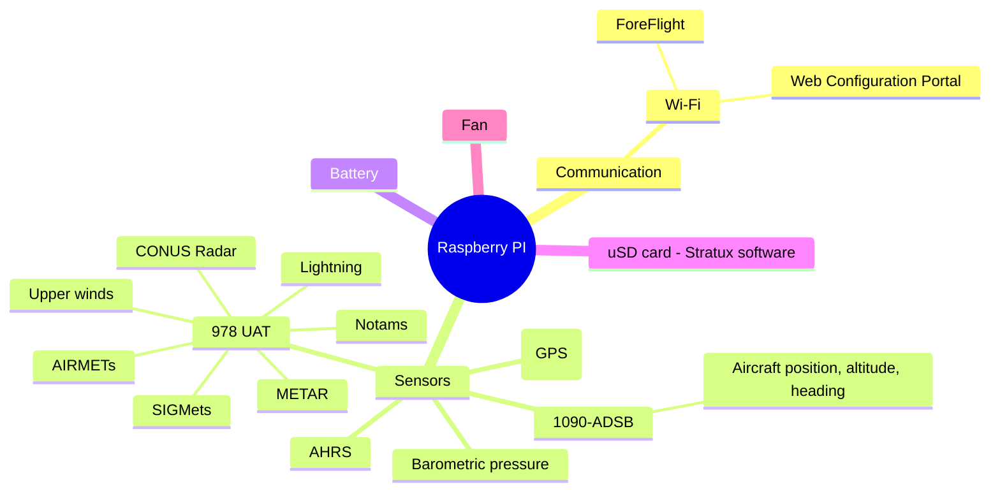

# Stratux &#9992; - Read-Only Edition

This is a fork of [stratux/stratux](https://github.com/stratux/stratux) built to be safe to power off by just pulling
the plug, plus some Wi-Fi and cockpit-usability tweaks. Download the SD card image from
[Releases](https://github.com/coder747-8i/stratux-readonly/releases).

### What's different in this edition

**SD card protection (read-only)**
- The root filesystem runs from a RAM overlay. This is inherited from upstream and is on unless "Persistent logging" is enabled.
- **New:** the FAT boot partition (`/boot/firmware`, which holds `stratux.conf`) is remounted **read-only** every time
  Stratux starts. It is made writable for under a second only while settings are saved or an update is uploaded.
  The file is written atomically (temp file, fsync, rename), so a power cut leaves either the old settings or the new ones.
- The Status and Cockpit pages show the protection state ("SD Card: Protected (read-only)").
- Pulling power is safe except while an update is being installed, or if Persistent logging is on.
- Shell aliases `bootrw` / `bootro`. Create `/boot/firmware/.stratux-boot-rw` to opt out.

**Wi-Fi tuning (fewer EFB dropouts)**
- Wi-Fi power save is always turned off. It is a common cause of iPads losing the Stratux.
- The regulatory domain is applied from the WiFi Country setting before the AP starts.
- New **WiFi TX Power** setting (driver default, or 20/17/14/10/7 dBm). A cockpit needs very little range.
- Settings page hints: use channel 1, 6 or 11; set your country; use AccessPoint (not AP+Client) mode in flight.

**Turn off what you don't use (less CPU load and heat)**
- The receiver, sensor and output toggles (GPS, UAT, 1090, OGN, AIS, APRS, AHRS, Baro, Ping, Pong) are moved out of
  Developer Mode into a normal **Hardware & Services** panel.
- **New Bluetooth LE toggle.** Off blocks the BT radio, which shares the 2.4 GHz antenna with Wi-Fi.

**Web UI**
- **New Cockpit page:** large, high-contrast green/amber/red tiles for GPS fix, NACp and accuracy, satellites, EFB
  clients, traffic, CPU temperature, SD protection and sensors. A red "NO DATA" banner appears if updates stop.
- The Status page shows a colored NACp badge (8 or higher is good) and the SD card protection state.

---

## US users

https://github.com/stratux/stratux/wiki/US-configuration

## EU users

This is a fork of the original cyoung/Stratux version, incorperating many contributions by the community to create a
nice, full featured Stratux image that works well for Europe, the US, and the rest of the world.

(see https://github.com/stratux/stratux/wiki/Stratux-EU-Structure)

## Disclaimer

This repository offers code and binaries that can help you to build your own traffic awareness device. We do not take any responsibility for what you do with this code. When you build a device, you are responsible for what it does. There is no warrenty of any kind provided with the information, code and binaries you can find here. You are solely responsible for the device you build.

## Features

* 1090 ADSB
* UAT
* OGN receiver functionality to receive several protocols on the 868Mhz frequency band, comparable to what the OpenGliderNetwork does
* Web Configuration Portal
   * Connect to the Stratux AP and browse to any address(eg. my-stratux.com) to reach the portal.
* Several improvements and bug fixes to GPS handling and chip configuration (by [VirusPilot](https://github.com/VirusPilot))
* Support for transmitting OGN via a TTGO T-Beam
* More robust sensor handling
* Traffic Radar and Map
* Support for traffic output via Bluetooth LE
* Estimation of Mode-S target distance
* Support for NMEA output (including PFLAA/PFLAU traffic messages) via TCP Port 2000 and [serial](https://github.com/stratux/stratux/wiki/Stratux-Serial-output-for-EFIS's-that-support-GDL90-or-Flarm-NMEA-over-serial)
* Over-the-air (OTA) software update (between minor releases)

## Building

Due to the modular nature of Stratux, there are many possibilities how you can build it to your needs.
You can find three popular variations in the form of complete build guides [here](https://github.com/stratux/stratux/wiki/Building-Stratux).
It also shows how you can modify your pre-built Stratux US version to run the EU version.

If you want to customize beyond that, or have different needs, you can find a full list of supported hardware/attachments [here](https://github.com/stratux/stratux/wiki/Supported-Hardware).

## Major vs. minor releases

Stratux uses [semantic versioning](https://semver.org), versions are MAJOR.MINOR eg, 3.6.

### Major versions

* Are necessary due to platform library or platform configuration changes
* OTA updates are <b>not</b> supported between major versions
  * It is technically possible to use the OTA update process between
major versions. However there can be significant effort to manually develop
and test the scripts involved in that process and at present these scripts
are not being developed.

### Minor version

* OTA updates are supported between minor versions
  * Some users have Stratux units mounted in their dash or other challenging locations.

## microSD capacity requirement

The goal is for the Stratux image to fit onto a 4GB microSD card. This ensures that existing Stratux units can continue to be upgraded to the latest Stratux releases. At the moment the image is ~1.4GB in size, easily fitting onto a 4GB card.

Due to the availabilty of much larger and low cost microSD cards this constraint may be revisited and expanded to 8GB if necessary.

We recommend using a 8GB or larger microSD card for your stratux system.

## Roadmap

* Remove custom bluez and librtlsdr builds once Debian:13 (Trixie) is available for the Raspberry PI

## Developing

See the [developer documentation](docs/README.md) for an index. Key starting points:
[architecture](docs/architecture.md), [building](docs/building.md),
[dev setup](docs/dev-setup.md), and the [integration guide](docs/integration/README.md).

## Docs in repository vs. in wiki

User facing documentation is stored in the wiki because the wiki is:

1. Easer to edit (via browser, without needing a PR)
1. Automatically published

Developer documentation is stored in the repository because:

1. Developer documentation is typically tied tightly to code. Changes to code and developer documentation should occur together in this case. Code releases are tied to their developer documentation.
1. In-repository markdown enables PRs and PR review, ensuring accuracy and alignment with other developers.
